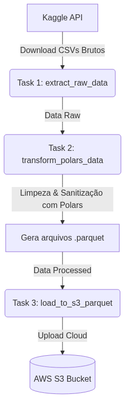

# 💳 Credit Score ETL Pipeline

Pipeline de ETL (Extração, Transformação e Carga) automatizado para dados de análise de score de crédito. O projeto extrai dados do Kaggle, realiza limpeza, deduplicação e tratamento de schemas, e persiste os dados transformados em formato colunar Parquet em um Data Lake no AWS S3.

---

## 📐 Arquitetura da Solução

  

---

## 🛠️ Tecnologias Utilizadas & Decisões de Arquitetura

* **Orquestração:** **Apache Airflow** executado via Docker Compose para garantir agendamento e monitoramento do pipeline.
* **Processamento de Dados:** **Polars**
* **Storage / Data Lake:** **AWS S3** para armazenamento escalável dos dados em formato colunar `.parquet`, otimizando custos e tempo de consulta para workloads analíticos futuros.
* **Containerização:** **Docker & Docker Compose** para isolamento total do ambiente de desenvolvimento e produção.

---

## 🔄 Fluxo do Pipeline (DAG)

A DAG `dag_credit_score_etl` é dividida em 3 etapas sequenciais principais:

1. **`extract_raw_data`:**
   * Conecta à API do Kaggle e faz o download dos arquivos brutos de treino e teste (`train.csv` e `test.csv`).
2. **`transform_polars_data`:**
   * Leitura e deduplicação total de registros com `unique()`.
   * Sanitização via Expressões Regulares (`str.replace_all`) para limpar strings e converter colunas para seus tipos corretos (`Int32` e `Float64`).
   * Imputação da mediana para valores nulos/ausentes de idade.
   * Exportação otimizada para o formato `.parquet`.
3. **`load_to_s3_parquet`:**
   * Utiliza a biblioteca `boto3` para realizar o upload seguro dos arquivos Parquet gerados para o bucket configurado na AWS.

---

## 📂 Estrutura do Repositório

├── dags/
│   └── credit_score_etl_dag.py   # Definição e orquestração do Airflow
├── src/
│   ├── extract.py                # Lógica de extração da API do Kaggle
│   ├── transform.py              # Tratamento e limpeza de dados com Polars
│   └── load.py                   # Lógica de upload dos Parquets para o AWS S3
├── data/                         # Mapeado via volume Docker (raw/ e processed/)
├── docker-compose.yml            # Definição dos serviços (Airflow, Postgres)
├── Dockerfile                    # Imagem customizada do Airflow
├── requirements.txt              # Dependências Python (polars, boto3, kaggle, etc)
└── README.md                     # Documentação do projeto

---

## 🚀 Como Executar o Projeto

### Pré-requisitos
* Docker e Docker Compose instalados.
* Credenciais ativas da **Kaggle API** (`kaggle.json`) e permissões de escrita em um **Bucket AWS S3** (`AWS_ACCESS_KEY_ID` e `AWS_SECRET_ACCESS_KEY`).

### Passo a Passo

1. **Clone o repositório:**
   git clone https://github.com/seu-usuario/data-girls-finance-etl.git
   cd data-girls-finance-etl

2. **Configure as Variáveis de Ambiente:**
   Crie um arquivo `.env` na raiz do projeto com as suas chaves de acesso:
   KAGGLE_USERNAME=seu_usuario_kaggle
   KAGGLE_KEY=sua_chave_kaggle
   AWS_ACCESS_KEY_ID=sua_aws_access_key
   AWS_SECRET_ACCESS_KEY=sua_aws_secret_key
   S3_BUCKET_NAME=nome-do-seu-bucket-s3

3. **Suba os Containers:**
   docker compose build
   docker compose up -d

4. **Acesse a Interface do Airflow:**
   * URL: http://localhost:8080
   * **Login:** `airflow` | **Senha:** `airflow`
   * Ative a DAG `dag_credit_score_etl` para iniciar a execução automática.

---

## 📈 Próximos Passos (Roadmap)

- [ ] Implementar arquitetura em camadas no S3 (Medallion: Bronze, Silver e Gold).
- [ ] Adicionar validações automáticas de Data Quality (ex: número de linhas, verificação de schema).
- [ ] Mapear as tabelas Parquet no AWS Glue Data Catalog para consultas via AWS Athena usando SQL.

---
*Desenvolvido como parte dos projetos de Engenharia de Dados*